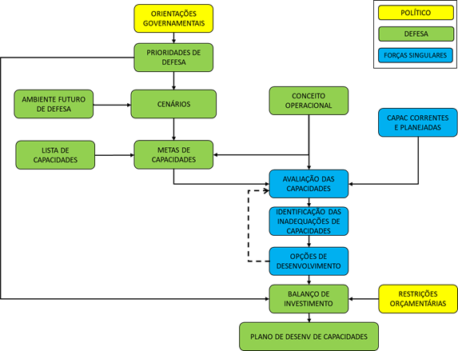
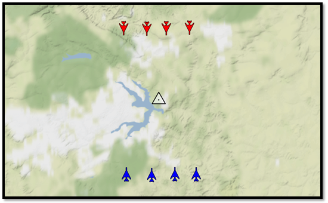
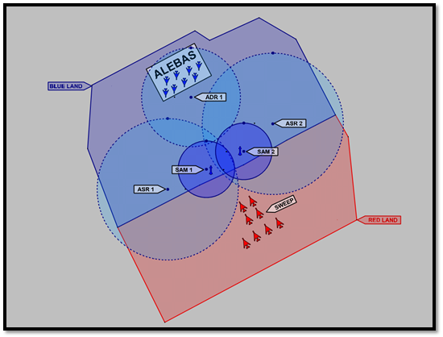
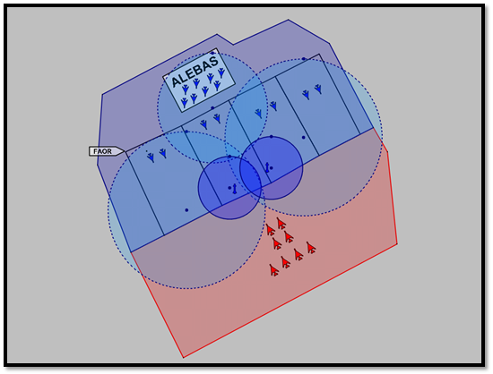
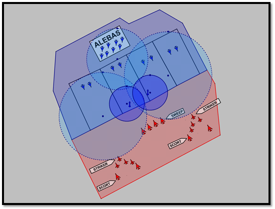
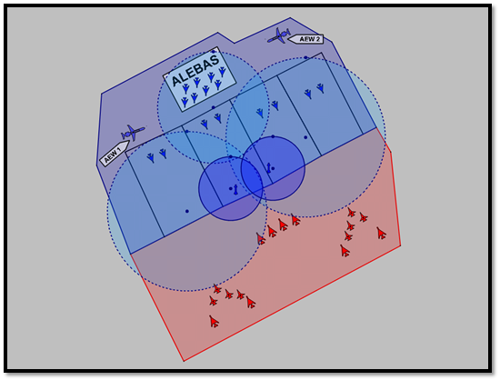

1. **OBJETIVO**

O objetivo do presente documento é dar cumprimento ao Process Activity
1.2 - Need Statement, previsto no Conceptual Model Best-Practice
Development Process emitido pela OTAN.

Este documento/produto define o uso pretendido dos Conceptual Models,
servindo como fonte primária para as atividades de levantamento de
requisitos.

2. **REFERÊNCIAS**

RTO Technical Report MSG-058 – Conceptual Modeling for Military Modeling
and Simulation:

-  5.2.1.2 PA1.2 – Define Purpose and Intended Use of M&S Effort;

-  6.2.2 Product 1.2 Guidance – Need Statement;

3. **DEFINIÇÕES**

Conceptual Model (CM): descrição do conteúdo e das representações
internas de um modelo, que constituem o entendimento conjunto de
patrocinadores, usuários e desenvolvedores, incluindo lógica e
algoritmos, e reconhecendo explicitamente as suposições e limitações.

Need: uma condição evidenciada pela ausência de algo ou pelo desejo de
possuir algo necessário; um desejo (‘want’) ou necessidade (‘need’) está
relacionado às expectativas ou intenções de um ou mais stakeholders.

4. **CONTEÚDO**

**4.1 INTRODUÇÃO**

O texto que se segue representa o entendimento comum entre o
Estado-Maior da Aeronáutica (EMAER) e a Gerência do Projeto ASA a
respeito de necessidades de Modelagem e Simulação (M&S) relacionadas à
metodologia do Planejamento Baseado em Capacidades (PBC).

Tais informações foram levantadas de diversas formas: participação em
reuniões e grupos de trabalho, documentações, conversas informais e
também por meio de um questionário elaborado pela Gerência, endereçado à
6ª Subchefia do EMAER, com o intuito de capturar as preferências e
necessidades do Sponsor do Projeto. O referido questionário encontra-se
anexo a este documento.

**4.2 SÍNTESE DA NECESSIDADE**

Antes de se empreender qualquer esforço na solução de um problema, é
importante certificar-se de estar resolvendo o problema correto.

A enunciação resumida da necessidade é uma ferramenta de comunicação
importante que ajuda a garantir que todos os membros de um projeto
saibam qual é o problema que precisam resolver e porque o projeto é
importante. Também ajuda a orientar atividades e decisões no âmbito do
projeto.

Usualmente, um Need Statement resumido é composto por três elementos
fundamentais: um usuário, sua necessidade e sua meta. Dessa forma,
convencionou-se a seguinte sentença para comunicar a necessidade de
maneira resumida:

**“O EMAER, órgão responsável pelo planejamento estratégico do Comando
da Aeronáutica, necessita compreender os cenários aeroespaciais e suas
consequências para o efetivo emprego do Poder Aeroespacial, a fim de
dimensionar qualitativamente e quantitativamente a Força Aérea para os
desafios futuros.”**

**4.3 DESCRIÇÃO DETALHADA DA NECESSIDADE**

O EMAER, seguindo orientações do Ministério da Defesa (MD), adotou o
Planejamento Baseado em Capacidades (PBC) como sistemática de
planejamento estratégico no âmbito do Comando da Aeronáutica (COMAER). O
PBC é uma metodologia de planejamento que parte das orientações emanadas
do Poder Político, associando a elas os potenciais cenários de emprego
do Poder Militar, bem como as restrições orçamentárias, a fim de
conceber e implementar uma estrutura de Defesa adequada aos anseios da
nação.

No contexto do PBC, o termo capacidade deve ser entendido como uma
aptidão para atingir um efeito desejado; efeito, por sua vez, representa
uma mudança em uma condição ou comportamento. De maneira simplificada,
pode-se dizer que o PBC busca estabelecer um processo de planejamento
racional e rastreável com as seguintes finalidades:

a. Identificar as capacidades necessárias em função de cenários
   aeroespaciais oriundos das Prioridades de Defesa;

b. Definir metas para as capacidades, considerando horizontes de curto,
   médio e longo prazos;

c. Identificar os níveis de suficiência ou proficiência de cada
   capacidade; e

d. Estabelecer um plano de obtenção de capacidades, a fim de atingir os
   níveis de suficiência e proficiência almejados.

Essa metodologia, embora simples na concepção, revela-se complexa na
execução, especialmente por ter que lidar com muitas incertezas e
projeções. A avaliação das capacidades, por exemplo, envolve aspectos
qualitativos e, muitas vezes, também subjetivos.

Diante dessa constatação, o EMAER deseja incorporar ferramentas de
análise ao PBC, nomeadamente, as **simulações construtivas**, que
possibilitem reduzir, tanto quanto possível, o nível de subjetividade na
avaliação das capacidades, pautando-as cada vez mais em métodos
científicos. Por outro lado, o EMAER compreende que toda e qualquer
simulação no escopo do PBC será sempre uma ferramenta de apoio à
decisão, e não de tomada de decisão. Por mais que os modelos tenham sido
verificados e validados, mesmo seguindo metodologias consolidadas, a
complexidade das decisões em nível estratégico extrapola o potencial das
possíveis respostas obtidas através de simulações construtivas e,
portanto, essas não eliminarão por completo subjetividade do
planejamento.

O EMAER espera que, com as simulações providas pelo ASA, seja possível
realizar as seguintes etapas de avaliação:

a. Diagnóstico: avaliação das capacidades atuais, planejadas e em
   obtenção;

b. Soluções não materiais: em caso de falta de suficiência ou
   proficiência no diagnóstico, realizar simulações envolvendo mudanças
   táticas e/ou doutrinárias;

c. Soluções materiais existentes: em caso de falta de suficiência ou
   proficiência das soluções não materiais, realizar simulações
   envolvendo melhorias em equipamentos existentes e/ou modernizações; e

d. Soluções materiais novas: em caso de falta de suficiência ou
   proficiência das opções anteriores, realizar simulações envolvendo
   novas aquisições ou desenvolvimento de novos equipamentos.

De acordo com a visão do EMAER, o Projeto ASA será considerado exitoso
se o protótipo do sistema de simulação desenvolvido permitir a
realização de um estudo de caso envolvendo todas as etapas de avaliação
descritas acima, contemplando cenários que envolvam as seguintes
temáticas, na ordem de prioridade em que aparecem:

-  Dimensionamento da Força;

-  Avaliação de novas aquisições; e

-  Avaliação de tecnologias do futuro.

Ainda a respeito dos objetivos do Projeto almejados pelo EMAER,
espera-se que a tecnologia desenvolvida, ainda que em nível
experimental, possa ser efetivamente empregada por analistas de uma
Organização Militar (OM) a ser definida oportunamente, a fim de executar
e analisar as simulações de interesse do PBC.

O critério de sucesso estabelecido pelo EMAER depende, necessariamente,
do estabelecimento de alguns casos operacionais adequados à avaliação
por meio de simulações (neste documento será empregada a expressão “caso
operacional” em sentido similar a “cenário operacional”). Mais à frente
serão detalhados os casos de interesse, sendo todos eles hipotéticos e
concebidos apenas para promover testes do ferramental em
desenvolvimento. Convém, entretanto, descrever desde já um possível
método generalista para a criação de casos de simulação no âmbito do
PBC, os quais, uma vez rodados no ASA, poderão fornecer subsídios para a
avaliação das capacidades.

O PBC é conduzido segundo um processo com etapas bem definidas, cujo
formato reduzido, mas adequado ao escopo da discussão em tela,
encontra-se ilustrado na Figura 1.

Figura 1 – Processo Resumido do PBC

Alguns elementos presentes no processo da Figura 1 necessitam ser
detalhados para melhor compreensão da metodologia de concepção dos
casos. São eles:

-  Cenários Aeroespaciais: descrição, em nível estratégico, dos
   contextos geopolítico e militar a partir dos quais o planejamento
   será realizado;

-  Contexto Futuro de Defesa: tendências tecnológicas e desafios futuros
   relacionados ao emprego do Poder Militar, considerando um horizonte
   temporal de 12 a 20 anos; e

-  Concepções de Operações (CONOPS): documentos que detalham a visão
   operacional sobre como a Força será empregada, relacionando quais
   capacidades contribuem para a realização de determinados efeitos; de
   maneira geral, as Ações de Força Aérea, descritas na DCA 1-1 Doutrina
   Básica da FAB, servem de "ponte" para o estabelecimento de uma
   relação entre um efeito específico (gerado pela ação em si) e uma
   capacidade.

Na metodologia adotada pelo EMAER, esses três elementos, Cenários
Aeroespaciais, Contexto Futuro de Defesa e CONOPS, fornecem os insumos
para que especialistas do segmento operacional da Força possam conceber
instâncias de casos operacionais condizentes com os contextos
geopolítico e militar assumidos no planejamento. Esses casos possuem uma
função importante no processo do PBC: servem de base para a realização
das análises relacionadas às etapas 'Metas de Capacidades' e 'Avaliação
de Capacidades' (ver Figura 1); sem um conjunto de casos operacionais,
os especialistas não teriam elementos e critérios suficientes para
conduzir suas avaliações e análises. Dado que tais casos detalham
fatores como quantidades e tipos de plataformas, armamentos e sensores,
todos interagindo em um contexto tático bem definido, acabam por
fornecer os inputs necessários para que especialistas em M&S, com
vivência operacional no âmbito da FAB, possam derivar os modelos
necessários à realização das simulações computacionais.

Tão importante quanto a própria especificação dos casos é a definição
dos outputs esperados ao final de uma simulação (ou de um conjunto
delas). A esse respeito, o EMAER espera que o ASA possa fornecer um
relatório contendo, pelo menos, as seguintes informações:

-  Probabilidade de sucesso da missão simulada;

-  Taxa de sobrevivência nas simulações;

-  Número de simulações realizadas até que um critério de parada,
   baseado na consistência dos resultados, tenha sido atingido; e

-  Conjunto de inputs usados nas simulações considerados relevantes para
   a interpretação dos resultados, tais como:

   -  quantidades/tipos de aeronaves e equipamentos presentes no caso;

   -  parametrização das entidades e equipamentos do caso (ex:
      configuração de radar);

   -  tática empregada pelo oponente nas simulações; e

   -  tática empregada pela própria força nas simulações;

Uma vez estabelecidos genericamente os outputs esperados das simulações,
convém descrever em detalhes os casos de interesse que farão parte do
escopo do Projeto ASA. Ressalta-se, mais uma vez, que todos eles são
hipotéticos e servem apenas para ilustrar possíveis situações de
análise. Além disso, as descrições dos contextos operacionais a serem
simulados serão apresentados na forma de “caso de simulação”, ou somente
“caso”. Um caso deve ser entendido como uma descrição genérica de um
contexto a partir do qual várias situações iniciais poderão ser geradas.
Para cada caso de simulação serão fornecidas as seguintes informações:

-  Tipos de componentes requeridos para as simulações (ex: aeronaves,
   radares, artilharia antiaérea, etc.);

-  Quantidade de componentes esperados para a configuração das situações
   iniciais;

-  Definição sobre as táticas; e

-  Definição sobre o atributo quantitativo de sucesso da missão.

A respeito das definições envolvendo o conceito de tática, cabe
esclarecer que, no âmbito do ASA, o termo talvez receba um significado
ligeiramente diferente daquele praticado pelo setor operacional da FAB;
a tática, nas simulações do ASA, deve ser entendida como um conjunto de
parâmetros que podem influenciar os outputs (alterar o desempenho da
força), independentemente da aquisição de novos sistemas ou da
modernização dos sistemas existentes.

**4.3.1 CASO 1**

Nesse tipo de caso, espera-se gerar uma situação tática que resulte em
engajamentos de combate aéreo além do alcance visual (Beyond Visual
Range – BVR).

O único componente requerido para as simulações do Caso 1 é o:

-  Fighter: aeronave de caça com características parametrizáveis (ex:
   velocidade máxima, carga g máxima, consumo de combustível, seção reta
   radar, etc), contendo, pelo menos, os seguintes subsistemas: radar de
   bordo, radar warning receiver (RWR), datalink, mísseis ar-ar
   radar-ativo.

A quantidade esperada de componentes nas situações iniciais do Caso 1 é
de:

-  1 a 8 Fighter BLUE; e

-  1 a 8 Fighter RED;

A definição de tática no Caso 1 será uma composição dos seguintes
parâmetros:

-  Tipo de formação de voo empregada por cada time no engajamento
   inicial (ex: box, vic, champagne, etc), incluindo o perfil vertical;

-  Shot Philosophy de cada time ou player;

-  Nível de agressividade de cada time ou player; e

-  Nível de experiência de voo de cada time ou player.

Outros fatores poderão ser considerados na composição da tática, de
acordo com as interações a serem estabelecidas entre os especialistas
dos corpos técnico e operacional durante o período de desenvolvimento.

O objetivo de cada time no Caso 1 será estabelecer uma Combat Air Patrol
(CAP) em uma região geográfica comum. Portanto, a probabilidade de
sucesso de cada time deverá ser mensurada como uma função do nível de
afastamento das aeronaves oponentes em relação à região de interesse, ao
longo do tempo.

Figura 2. Exemplo de situação inicial decorrente do Caso 1.

**4.3.2 CASO 2**

Nesse tipo de caso espera-se simular a resposta de um sistema de defesa
aérea contra a incursão de um conjunto de aeronaves de caça agressoras
(similar à missão de Sweep no contexto de um Composite Air Operation –
COMAO). O sistema de defesa aérea sob avaliação deverá ser composto por
radares, aeronaves de caça operando a partir de alerta em solo, e
unidades antiaéreas de míssil.

Os tipos de componentes requeridos para as simulações do Caso 2 são:

-  Fighter: já definido;

-  Air Surveilance Radar (ASR): características típicas de um radar de
   vigilância aérea;

-  Air-Defense Radar (ADR): características típicas de um radar de
   defesa aérea; e

-  Surface-to-Air Missile (SAM): sistema de mísseis superfície-ar com
   características similares aos sistemas S-400/Patriot.

A quantidade esperada de componentes nas situações iniciais do Caso 2 é
de:

-  4 a 16 Fighter BLUE;

-  4 a 16 Fighter RED;

-  Até 2 ASR BLUE;

-  Até 2 ADR BLUE; e

-  Até 2 SAM BLUE.

A tática do time BLUE será definida pela composição dos seguintes
fatores, além daqueles já listados no Caso 1:

-  Tempo decorrido entre a primeira aparição da Sweep nos radares e a
   classificação das pistas como hostil;

-  Tempo decorrido entre a classificação das pistas como hostil e o
   acionamento do alerta;

-  Quantidade de aeronaves acionadas por vez;

-  Tempo decorrido entre o acionamento do alerta e a decolagem das
   aeronaves; e

-  Tempo decorrido entre decolagens do alerta na base por localidade.

A tática do time RED será definida pela composição dos fatores já
mencionados no Caso 1.

Quanto aos objetivos de cada time no Caso 2, pode-se considerar que:

-  RED: estabelecimento de CAP em áreas sensíveis localizadas no
   interior do território BLUE; a probabilidade de sucesso do time
   vermelho, portanto, será medida como uma função do nível de
   afastamento das aeronaves BLUE em relação às CAP;

-  BLUE: ao invés de se estabelecer um critério único de sucesso para a
   defesa aérea, poderão ser concebidas algumas métricas que capturem
   diferentes aspectos, por exemplo:

   -  proporção de aeronaves RED que cruzaram a linha de contato sem
      serem detectadas;

   -  proporção de aeronaves RED que cruzaram a linha de contato sem
      serem classificadas como hostil;

   -  proporção de aeronaves RED que alcançaram as regiões sensíveis;

   -  tempo decorrido até que todas as aeronaves RED no interior do
      território BLUE tenham sido engajadas (por outra aeronave ou SAM).

Outras métricas poderão ser propostas pela equipe de desenvolvimento do
ASA, inclusive formas de agregação entre elas.

Figura 3. Exemplo de situação inicial decorrente do Caso 2.

**4.3.3 CASO 3**

Similar ao Caso 2, porém, com a inclusão de aeronaves Fighter BLUE
cumprindo missão de alerta em voo segundo a doutrina de emprego baseada
em Flight Areas of Responsibility (FAOR).

Os tipos de componentes requeridos para as simulações do Caso 3 são os
mesmos descritos no Caso 2.

A quantidade esperada de componentes nas situações iniciais do Caso 3 é
de:

-  8 a 14 Fighter BLUE (alerta em base);

-  8 a 14 Fighter BLUE (alerta em voo), distribuídos em FAOR com
   capacidade para 2 ou 4 aeronaves;

-  8 a 16 Fighter RED;

-  Até 2 ASR BLUE;

-  Até 2 ADR BLUE; e

-  Até 2 SAM BLUE.

A tática de BLUE, além dos fatores já citados no Caso 2, será composta
também por:

-  Quantidade de FAOR; e

-  Número de aeronaves por FAOR.

A tática do time RED será definida pela composição dos fatores já
mencionados no Casos 1.

Os objetivos dos times no Caso 3 são os mesmos já considerados no Caso
2.

Figura 4. Exemplo de situação inicial decorrente do Caso 3.

**4.3.4 CASO 4**

Similar ao Caso 3, porém, com a inclusão de aeronaves RED cumprindo
missão de ataque ao solo (similar ao papel de Striker no contexto de um
COMAO). Com a inclusão de atacantes nas simulações, os caças do time RED
poderão cumprir tanto missões de Sweep quanto missões de Escort.

Os modelos envolvendo o emprego ar-solo devem ser concebidos de forma a
possibilitar a comparação de alguns armamentos com relação aos seguintes
atributos:

-  Área Média de Eficácia (AME);

-  Dano colateral;

-  Distância de lançamento; e

-  Carga explosiva.

A lista de componentes requeridos para as simulações do Caso 4, além
daqueles citados no Caso 3, inclui também:

-  Striker: aeronave de caça com características parametrizáveis (ex:
   velocidade máxima, carga g máxima, consumo de combustível, seção reta
   radar, etc), contendo, pelo menos, os seguintes subsistemas: radar de
   bordo, radar warning receiver (RWR), datalink, bombas de fins gerais
   (guiadas ou não).

A quantidade esperada de componentes nas situações iniciais do Caso 4 é
de:

-  8 a 14 Fighter BLUE (alerta em base);

-  8 a 14 Fighter BLUE (alerta em voo), distribuídos em FAOR com
   capacidade para 2 ou 4 aeronaves;

-  Até 8 Fighter RED;

-  8 a 16 Striker RED;

-  Até 2 ASR BLUE;

-  Até 2 ADR BLUE; e

-  Até 2 SAM BLUE.

A definição da tática de BLUE no Caso 4 é similar ao Caso 3. No caso de
RED, a tática passará a contar também com os seguintes fatores:

-  Quantidade de Fighters alocados para a missão de Sweep; e

-  Quantidade de Fighters alocados para a missão de Escort.

Quanto aos objetivos dos times, além daqueles já estabelecidos no Caso
2, deverão ser acrescidos os seguintes:

-  RED: lançamento de bombas sobre alvos localizados no território BLUE;
   a probabilidade de sucesso do time RED, portanto, passa a ser dada
   também pela proporção de ataques bem sucedidos;

-  BLUE: evitar ataques aéreos sobre seu território; a qualidade da
   defesa aérea de BLUE, portanto, deve incluir indicadores que capturem
   a proporção de aeronaves RED impedidas de realizar o lançamento de
   suas bombas.

Figura 5. Exemplo de situação inicial decorrente do Caso 4.

**4.3.5 CASO 5**

Similar ao Caso 4, porém, com a inclusão de aeronaves BLUE cumprindo
missão de alarme aéreo antecipado (Airborne Early Warning – AEW). A
ideia da inclusão de aeronaves desse tipo na simulação é avaliar o
aumento da cobertura radar e a consequente melhora na detecção de alvos,
em especial, aqueles voando a baixa altura.

A lista de componentes requeridos para as simulações do Caso 5, além
daqueles enumerados no Caso 4, inclui também:

-  AEW: aeronave com características similares ao E-99.

A quantidade esperada de componentes nas situações iniciais do Caso 5,
além de todos já especificados no Caso 4, é de:

-  Até 2 AEW BLUE.

As táticas e objetivos dos times no Caso 5 são os mesmos já descritos no
Caso 4.

Figura 6. Exemplo de situação inicial decorrente do Caso 5.

Tendo sido especificados os casos de interesse que devem balizar o
desenvolvimento do protótipo do sistema de simulação, torna-se oportuno
também registrar a visão de médio prazo do EMAER a respeito do ASA.

O EMAER tem ciência de que o artefato computacional em desenvolvimento
no âmbito do projeto trata-se de um protótipo que, a rigor, não deve ser
entendido como um software de usuários finais. Para que o ASA venha a se
tornar um produto, é fundamental o envolvimento de uma empresa ou outra
organização militar que possa receber a tecnologia e arcar, pelo menos,
com sua manutenção após o encerramento do projeto. O EMAER entende que a
tecnologia desenvolvida pelo Projeto ASA deverá ser incorporada ao
software SPCOA (em desenvolvimento pelo CCA-SJ) na forma de uma máquina
de simulação.

**Questionário endereçado ao Sponsor do Projeto ASA**

**1. INTRODUÇÃO** 

O presente documento tem por objetivo levantar informações junto ao
EMAER a fim de guiar as ações de gerência e desenvolvimento do Projeto
ASA do IEAv.

As respostas aos questionamentos elencados a seguir permitirão que a
equipe do ASA tenha uma visão mais clara sobre as necessidades do EMAER
com relação à simulação, e também servirão de base para as atividades de
elicitação de requisitos. Adicionalmente, poderão ainda auxiliar o
próprio EMAER na definição de seus problemas e necessidades.  

 

**2. QUESTIONÁRIO**

**Sobre o uso de simulações construtivas** 

1) Por que as simulações construtivas seriam importantes para o ciclo do
PBC? 

Resposta: O objetivo principal das simulações construtivas para o PBC é
subsidiar a definição da melhor configuração de Força para enfrentar os
desafios futuros, com menor subjetividade e maior cientificidade. 

As simulações construtivas têm algumas finalidades durante o processo do
PBC: 

a) diagnóstico da Força: verificar se os atributos qualitativos e
   quantitativos das capacidades são suficientes para enfrentar os
   desafios futuros em termos de suficiência e proficiência; 

b) caso o diagnóstico seja negativo por insuficiência, verificar qual a
   quantidade de meios ideais para enfrentar os desafios futuros; 

c) caso o diagnóstico seja negativo por proficiência, identificar quais
   atributos qualitativos e quantitativos das capacidades tem que ser
   melhorados para enfrentar os desafios futuros (exemplo: alguma
   modernização ou melhoria nos equipamentos existentes); e 

d) avaliar soluções novas e/ou disruptivas para enfrentar os desafios
   futuros. 

2) De acordo com a visão do EMAER, enquanto órgão de direção estratégica
da FAB, quais seriam os graus de importância atribuídos a cada uma das
possíveis aplicações listadas a seguir, sendo todas elas referentes ao
uso de simulações construtivas? (00 – nenhuma importância; 10 – máxima
importância; deixar em branco se não souber avaliar)

Nota: talvez algumas dessas possibilidades não se apliquem diretamente
ao PBC, mas as respostas servirão de informação para que a equipe do ASA
tenha uma visão mais abrangente sobre como o EMAER avalia as
necessidades do uso da simulação construtiva no âmbito da FAB como um
todo.

(02) Avaliação/prospecção de cenários hipotéticos (EMAER)

(10) Dimensionamento da Força (EMAER)

(09) Avaliação de novas aquisições (EMAER)

(09) Avaliação de tecnologias do futuro (EMAER) 

(05) Seleção de Cursos de Ação no contexto das Operações Aéreas (COMAE) 

(06) Avaliação de novas táticas e doutrinas (COMPREP)

(04) Condução de Jogos de Guerra (ECEMAR)

(03) Integração das Simulações Virtuais da Força (COMPREP)

**Sobre o processo decisório do PBC** 

Considerando que, em geral, os resultados das simulações construtivas
são usados como ferramenta de apoio à decisão, e levando em conta também
os diversos perfis dos cenários hipotéticos gerados para o PBC:

3) Em termos gerais, o que se deseja saber ao final de uma simulação
desses cenários? Já é possível elencar questionamentos específicos que
precisam ser respondidos a partir da simulação dos cenários de
interesse? (ex:taxa de sobrevivência, indicador que reflita o percentual
do cumprimento da missão, custos aproximados)

Nota: a equipe do ASA está disposta a criar e propor índices e métricas
que possam auxiliar o EMAER em suas decisões, por isso, gostaria de
conhecer os principais anseios ao se utilizar a simulação para apoio à
decisão.

Resposta: Hoje, o EMAER espera um relatório com os seguintes itens:

-  Possibilidade do inimigo (tática empregada);

-  Tática empregada para suplantar o oponente, seja ofensiva ou
   defensiva;

-  Atributos qualitativos e quantitativos utilizados (suficiência e
   proficiência);

-  Probabilidade de sucesso (%);

-  Taxa de sobrevivência (% perdas); e

-  Número de simulações realizadas para a consistência da informação.

Em paralelo, devido à experiência da equipe do ASA durante seu
desenvolvimento, a mesma poderia propor melhorias nos itens esperados.

4) Qual é o entendimento atual para a aplicações dos resultados que
seriam extraídos das simulações dentro do processo do PBC? E como estes
seriam inseridos dentro do processo? Por exemplo: as simulações seriam
executadas antes da reunião dos especialistas, gerando fatores de
planejamento ou seriam executadas após para validar métricas e/ou
requisitos?

Resposta: Conforme o passo a passo descrito na pergunta 1, a letra “a”
seria o diagnóstico da força, ou seja, seria a primeira fase de
simulações logo após a definição da Concepção Operacional Conjunta
(definição de táticas a serem empregadas com os meios existentes) e
metas de efetividade (espera-se, futuramente, que a Inteligência faça
antes da reunião dos especialistas). Após o diagnóstico, ocorreria a
reunião com os especialistas para o levantamento das metas de desempenho
e soluções de força, ou seja, as letras “b”, “c” e “d” da pergunta 1,
onde haveria uma nova fase de simulações.

5) Há uma expectativa sobre quem será o principal usuário dos resultados
das simulações? Em outras palavras, o EMAER planeja usar os resultados
diretamente, ou alguma OM intermediária seria responsável por gerar
relatórios contendo análises?

Resposta: Espera-se que as simulações construtivas do ASA tenham 3
usuários finais:

-  EMAER: diagnóstico e dimensionamento da força; 

-  COMPREP: desenvolvimento de doutrina e táticas; e 

-  COMAE: definição da melhor LA para situação real específica. 

..

    

**Sobre as expectativas do EMAER a respeito do Projeto ASA**

6) O EMAER entende o ASA apenas como um projeto de desenvolvimento,
cujos entregáveis têm potencial para auxiliar na solução de alguns de
seus problemas específicos, ou também um projeto de pesquisa que poderá
gerar novos conhecimentos para a FAB como um todo? Em outras palavras, o
EMAER se reconhece mais como um financiador/cliente com necessidades bem
definidas, ou como um fomentador e parte interessada do Projeto ASA?

Nota: esse posicionamento é importante para que a equipe do ASA julgue
até que ponto pode contribuir com sugestões. Em geral, a figura de um
cliente que conhece a fundo seu problema está mais interessado em ver
suas necessidades atendidas completamente, sem esperar muitas
contribuições do segmento técnico; por outro lado, quando o problema não
está claramente definido, o patrocinador do projeto passa a enxergar o
setor técnico como um parceiro que pode ajudá-lo a atender suas
necessidades.

Resposta: o EMAER se reconhece mais como um financiador/cliente com
necessidades bem definidas, conforme resposta da pergunta 5. 

7) O EMAER considera a possibilidade de que o ASA, atualmente um
protótipo, possa vir a ser desenvolvido a ponto de se tornar um produto
final?

Nota: essa visão traz grandes implicações na maneira como o projeto será
conduzido e pode afetar, por exemplo, o tempo de desenvolvimento, já
que, com a perspectiva de transferir a tecnologia para uma empresa ou
outra OM, uma série de formalismos precisam ser adotados desde o
presente momento.

Resposta: o EMAER espera que o ASA seja um produto final no futuro, como
um módulo do SPCOA, conforme resposta da pergunta 5, bem como a
plataforma seja ampliada para atender:  

-  Integração das simulações virtuais da Força, conforme a NOP
   001/IEAV/2018; 

-  Jogos de guerra da ECEMAR. 

8) De acordo com a visão do EMAER, qual critério deve ser utilizado para
medir o sucesso do Projeto ASA? (ex: o protótipo do simulador
funcionando, a resposta a um tipo de cenário específico)

Resposta: Conforme a resposta da pergunta 1, espera-se que a fases 2
seja avaliada por um estudo de caso que siga os passos dos itens “a” a
“d”:

a) diagnóstico (capacidades atuais e em obtenção);

b) soluções não materiais (mudança de doutrina e táticas);

c) soluções materiais existentes (modernização ou melhoria de
      equipamentos existentes);

d) soluções materiais novas (novas aquisições ou desenvolvimento).

9) Considere na lista abaixo as várias características almejadas para o
protótipo que está sendo gerado pelo Projeto ASA e identifique o grau de
importância de cada uma delas para o EMAER. Essas características não
são como requisitos do sistema, mas, em vez disso, são "benefícios" ou
recursos menos tangíveis que, no entanto, são considerados essenciais
para o sucesso do projeto. (Ordenar todas de acordo com o grau de
importância; 1 - característica mais importante; 6 - característica
menos importante)

(3) Facilidade de uso

(5) Baixo custo

(1) Geração de relatórios

(2) Flexibilidade (possibilidade de adaptar-se a outras aplicações além
do PBC)

(4) Modularidade (possibilidade de sofrer extensões) 

(6) Interoperabilidade com outros sistemas 

10) Com base nas respostas acima, listar pelo menos três funcionalidades
(recursos tangíveis) para o protótipo, na forma de requisitos do tipo
“DEVERÁ”, sob pena do artefato computacional ser considerado como não
aceitável caso não possua tais recursos. Por exemplo: o ASA DEVERÁ
possuir interface que permita visualizar a simulação corrente.

Nota: podem ser listados tantos requisitos quantos se queiram.

Resposta: 

-  O ASA DEVERÁ possuir interface que permita visualizar a simulação
   corrente;

-  O ASA DEVERÁ possuir interface para modificação de tática empregada,
   remanejando o posicionamento dos meios entre simulações;

-  O ASA DEVERÁ possuir a funcionalidade de replay da simulação corrente
   para que o operador possa verificar os detalhes dos eventos;

-  O ASA DEVERÁ possuir um pop up de mensagens dos eventos mais
   importantes dos eventos (ex.: #1 azul lançou míssil, #2 vermelho
   abatido, conforme o STK). Estas mensagens devem ser mapeadas junto ao
   COMPREP. 

 

**Sobre os modelos e relatórios a serem desenvolvidos** 

11) É possível conceber modelos que favoreçam a fidelidade na
representação de determinados sistemas (ex: aeronave, míssil), mas que,
por outro lado, deixam a desejar no quesito generalidade, isto é,
torna-se difícil reconfigurar seus parâmetros para que representem outro
sistema. A fim de ilustrar tal situação, considere o seguinte exemplo:
na modelagem de um míssil cujos detalhes técnicos são bastante
conhecidos, podem ser utilizados atributos como: curva de empuxo x
tempo, coeficientes aerodinâmicos que variam segundo a deflexão das
aletas, e assim por diante. Dessa forma, suponha que algumas simulações
tenham sido realizadas e verificou-se que o alcance desse míssil em
perfil MAX RANGE (alvo não manobrável) seria de 45 NM. Caso o analista
sinta a necessidade de representar um míssil de alcance MAX RANGE de 60
NM a partir do mesmo modelo, como modificar o coeficiente de arrasto, ou
como aumentar o empuxo, por exemplo, a fim de que tal requisito seja
alcançado? Da mesma forma, modelos que favoreçam a generalidade acabam
perdendo no quesito fidelidade. Os modelos que favorecem a fidelidade,
em geral, demandam bastante tempo para serem desenvolvidos e, muitas
vezes, apenas os fabricantes dos artefatos possuem todas as informações
necessárias para a completa representação do equipamento em um ambiente
simulado. Por outro lado, modelos generalistas podem ser desenvolvidos
em um espaço de tempo mais curto, tendo, em contrapartida, aplicações
mais limitadas em função das simplificações assumidas. Diante de tal
exposição, percebe-se, claramente, que o nível de complexidade dos
modelos trata-se de uma decisão de projeto. Do ponto de vista do EMAER,
qual opção parece ser a mais interessante para suas necessidades?

Obs: a opinião da equipe do ASA é a de que, diferentemente do adotado na
primeira fase do projeto, devemos, nesta fase, começar com modelos mais
generalistas, compreendendo e documentando as limitações envolvidas,
aumentando a fidelidade à medida que seja necessário/possível.  

Resposta: Com o intuito de acelerar o desenvolvimento do processo,
pode-se adotar modelos mais generalistas. Por outro lado, há preocupação
por parte dos estudos do PBC com a seleção do armamento mais adequado
para cada situação, sendo assim, a parte de emprego ar-solo deve ser
desenvolvida para que seja possível a comparação de diversos artefatos
em relação a alguns atributos, tais como: AME, dano colateral e carga
explosiva. Assim, os detalhamentos esperados de cada modelo podem ser
discutidos em reuniões intermediárias entre IEAv, EMAER, COMPREP e
COMAE.

12) Sobre o processo de concepção dos modelos, a equipe do ASA acredita
que o levantamento dos conhecimentos operacionais necessários seja de
responsabilidade do IAOP. Caso o IAOP não possua especialistas com
conhecimentos suficientes para opinar e contribuir em determinada
modelagem, o próprio COMPREP será responsável por identificar um ponto
focal no segmento operacional que possa dirimir dúvidas. Qual é a
posição do EMAER sobre esse assunto?

Resposta: Esta definição deverá ser feita em reunião entre os clientes
envolvidos, mas acredita-se que a proposta do IEAv esteja de acordo com
as responsabilidades futuras no processo do PBC.

13) A visualização de uma simulação, por si só, pode ser considerada uma
ferramenta de análise, bem como um recurso importante de verificação e
acreditação. Qual é o entendimento atual do EMAER sobre o uso de
visualização das simulações no processo do PBC?

Resposta: No nível EMAER, a ferramenta será utilizada para análise dos
níveis ideias de capacidade para cada Cenário Aeroespacial. Com relação
a verificação e acreditação, talvez seja uma funcionalidade mais
explorada no nível COMPREP, por meio do IAOP.
