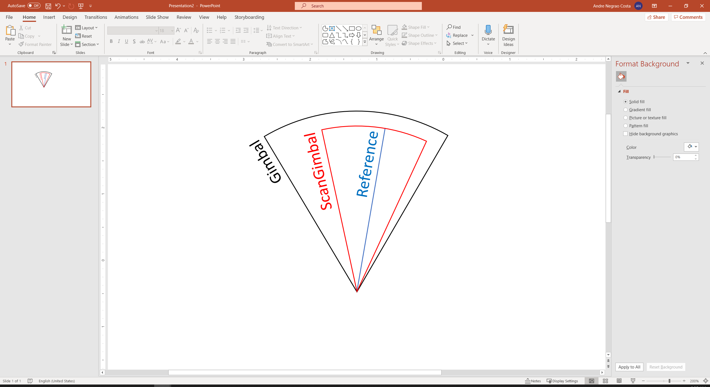
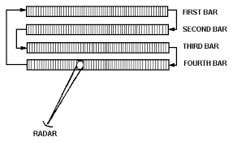
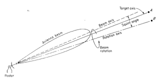
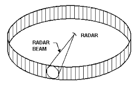
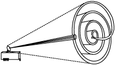

**RF Flow**

1. **Antenna1::System::runTimeCriticalRoutines(Phase 0)**

External application (*Node*) faz a chamada do método
'runTimeCriticalRoutines' da classe *WorldModel* (que estende
*Simulation*). Esse método, que representa um frame da simulação, dá
origem a quatro séries de chamadas aos métodos de mesmo nome dos
*Players*; cada série representa uma phase do frame: 'dynamics',
'transmit', 'receive' e 'process'. O pseudo-código dessa sequência de
chamadas é fornecido a seguir.

   WorldModel::runTimeCriticalRoutines()

   {

   for (i in 0:3)

   {

   phase = i;

   for (each Player)

   {

   Player.runTimeCriticalRoutines();

   }

   }

   frame += 1;

   }

   Player::runTimeCriticalRoutines()

   {

   for (each System)

   {

   System.runTimeCriticalRoutines();

   }

   }

Como consequência, cada *Player* irá chamar o mesmo método de cada um de
seus sistemas (classes *System*). Dessa forma, todas as classes
relacionadas a emissões de radiofrequência serão ativadas.

Cada *System*, ao receber uma chamada ao método
'runTimeCriticalRoutines', em função da fase corrente definida pela
classe *WorldModel*, irá chamar o método correspondente de sua
estrutura: 'dynamics', 'transmit', 'receive' e 'process'.

Na fase 0, métodos relacionados à dinâmica serão chamados. Somente o
sistema *Antenna* possui elementos dinâmicos, portanto, somente o método
'dynamics' dela será chamado quando o *Player* estiver nessa fase.

2. **Antenna1::ScanGimbal::dynamics()**

Toda vez que o método 'dynamics' for acionado, a classe *ScanGimbal*
calculará uma nova posição para o feixe de acordo com um padrão de
varredura. Essa nova posição é repassada para a classe *Gimbal*, que
gerencia a atuação do servo-controlador. A classe *ScanGimbal* possui
atributos e métodos referentes à atuação do feixe, já a classe *Gimbal*
estabelece os limites físicos em que o feixe pode atuar. A referência do
*ScanGimbal* permite estabelecer padrões de busca, conforme definidos no
método 'scanController'.

3. **Antenna1::ScanGimbal::scanController()**

Em função do tipo de varredura selecionada, faz-se a chamada ao método
de controle correspondente:

-  'manualController': permite que a nova posição comandada do
   servo-controlador (atributo 'cmdPos' da classe *Gimbal*) seja
   definida manualmente;

-  'barScanController': define a nova posição comandada do
   servo-controlador (atributo 'cmdPos' da classe *Gimbal*), realizando
   uma varredura por barras, horizontal ou vertical;

-  'conicalScanController': define a nova posição comandada do
   servo-controlador (atributo 'cmdPos' da classe *Gimbal*), realizando
   uma varredura cônica ao redor do alvo (com raio fixo).

-  'circularScanController': a nova posição do servo-controlador é
   definida segundo uma varredura circular (e.g, radares de vigilância
   de tráfego aéreo).

-  'spiralScanController': define a nova posição comandada do
   servo-controlador (atributo 'cmdPos' da classe *Gimbal*) realizando
   uma varredura espiral ao redor do alvo (com raio variável).

-  'pseudoRandomScanController': define a nova posição comandada do
   servo-controlador (atributo 'cmdPos' da classe *Gimbal*) realizando
   uma varredura pseudo-aleatória.

4. **Antenna1::Gimbal::dynamics()**

Toda vez que o método 'dynamics' do *Gimbal* é chamado, o
servo-controlador é solicitado a calcular sua nova posição por meio da
chamada ao método 'servoController'.

5. **Antenna1::Gimbal::servoController()**

Define a nova posição do gimbal em função do valor comandado, da
velocidade angular, da máxima velocidade angular e dos limites de
posição.

Se o tipo do gimbal for eletrônico, não há limite de velocidade angular
considerado, ou seja, o posicionamento é realizado instantaneamente,
caso contrário o atributo 'maxRate' é considerado.

Se o servo estiver no modo rate, o valor do atributo 'rate' é igualado
ao do atributo 'cmdRate'.

6. **Radar1::System::runTimeCriticalRoutines(Phase 1)**

Na fase 1, métodos relacionados à transmissão serão chamados. Somente o
sistema *Radar* possui elementos de transmissão, portanto, somente o
método 'transmit' da classe *Radar* será chamado quando o frame da
simulação estiver nessa fase.

7. **Radar1::Radar::transmit()**

Na classe *Radar* (e naquelas que herdam dela), toda emissão parte do
método 'transmit', no qual uma instância da classe *Emission* é criada e
preenchida. Para detalhes sobre quem é responsável por preencher cada um
dos atributos da emissão em cada fase, consulte a tabela abaixo.

+---------+----------------+------------------------------------------+
| Se      | Quem preenche? | Comentários                              |
| nsorMsg |                |                                          |
+=========+================+==========================================+
| maxRng  | R              | Distância corrente selecionada no        |
|         | adar::transmit | sistema R/F. Depende dos valores         |
|         |                | definidos no atributo 'ranges' da classe |
|         |                | *RfSensor*.                              |
+---------+----------------+------------------------------------------+
| rng     | Anten          | Calculado pela classe *Tdb* (distância   |
|         | na::rfTransmit | vetorial entre emissor e alvo).          |
+---------+----------------+------------------------------------------+
| rngRate | Anten          | Calculado pela classe *Tdb* (diferença   |
|         | na::rfTransmit | das velocidades vetoriais na direção da  |
|         |                | LOS).                                    |
+---------+----------------+------------------------------------------+
| gaz     | Anten          | Gimbal azimute - este valor é calculado  |
|         | na::rfTransmit | no método 'servoController' da classe    |
|         |                | *Gimbal*.                                |
+---------+----------------+------------------------------------------+
| gel     | Anten          | Gimbal elevação - este valor é calculado |
|         | na::rfTransmit | no método servoController da classe      |
|         |                | *Gimbal*.                                |
+---------+----------------+------------------------------------------+
| iaz     | P              | Ângulo de incidência no target (AOI) -   |
|         | layer::handleR | azimute                                  |
|         | fEmissionEvent |                                          |
+---------+----------------+------------------------------------------+
| iel     | P              | Ângulo de incidência no target (AOI) -   |
|         | layer::handleR | elevação                                 |
|         | fEmissionEvent |                                          |
+---------+----------------+------------------------------------------+
| losO2T  | Anten          | Vetor LOS normalizado de ownship para    |
|         | na::rfTransmit | target (sistema NED)                     |
+---------+----------------+------------------------------------------+
| losT2O  | Anten          | Vetor LOS normalizado de target para     |
|         | na::rfTransmit | ownship (sistema NED)                    |
+---------+----------------+------------------------------------------+
| re      | R              | Return request - definido de acordo com  |
| turnReq | adar::transmit | o valor do atributo 'recvEnable' da      |
|         |                | classe *RfSystem*.                       |
+---------+----------------+------------------------------------------+
| gimbal  | Anten          | O gimbal que transmitiu a mensagem       |
|         | na::rfTransmit |                                          |
+---------+----------------+------------------------------------------+
| ownship | Anten          | O player ownship                         |
|         | na::rfTransmit |                                          |
+---------+----------------+------------------------------------------+
| target  | Anten          | O player target                          |
|         | na::rfTransmit |                                          |
+---------+----------------+------------------------------------------+
| dataMsg | null           | Eventual mensagem de dados anexada à     |
|         |                | emissão (exemplo: datalink)              |
+---------+----------------+------------------------------------------+
|         |                |                                          |
+---------+----------------+------------------------------------------+
| E       | Quem preenche? | Comentários                              |
| mission |                |                                          |
+---------+----------------+------------------------------------------+
| freq    | R              | Definido de acordo com o valor do        |
|         | adar::transmit | atributo 'frequency' da classe           |
|         |                | *RfSystem*.                              |
+---------+----------------+------------------------------------------+
| lambda  | Emission       | Ocorre no método 'setFrequency' de       |
|         | ::setFrequency | *Emission*                               |
+---------+----------------+------------------------------------------+
| pw      | R              | O valor é o definido pelo atributo       |
|         | adar::transmit | 'pulseWidth' da classe *RfSensor*.       |
+---------+----------------+------------------------------------------+
| bw      | R              | O valor é o definido pelo atributo       |
|         | adar::transmit | 'bandWidth' da classe *RfSystem*.        |
+---------+----------------+------------------------------------------+
| prf     | R              | O valor é o definido pelo atributo 'prf' |
|         | adar::transmit | da classe *RfSensor*.                    |
+---------+----------------+------------------------------------------+
| pulses  | R              | O valor é calculado no próprio método    |
|         | adar::transmit | 'transmit', da seguinte forma: pulses =  |
|         |                | (prf \* dt) + 0.5                        |
+---------+----------------+------------------------------------------+
| power   | R              | A classe *Radar* preenche com o valor da |
|         | adar::transmit | potência de pico (atributo 'powerPeak'   |
|         | Ante           | da classe *RfSystem*).                   |
|         | nna:rfTransmit |                                          |
|         |                | A classe *Antenna* usa a potência de     |
|         |                | pico para calcular a potência efetiva,   |
|         |                | considerando o ganho da antena na        |
|         |                | direção do alvo.                         |
+---------+----------------+------------------------------------------+
| gain    | Ante           | Ganho efetivo da antena                  |
|         | nna:rfTransmit |                                          |
+---------+----------------+------------------------------------------+
| lossRng | Emis           | Perda causada pela distância entre       |
|         | sion::setRange | transmissor e receptor.                  |
+---------+----------------+------------------------------------------+
| lo      | Emiss          | Perda por atenuação atmosférica.         |
| ssAtmos | ion::lossAtmos |                                          |
+---------+----------------+------------------------------------------+
| l       | R              | Perda na transmissão - O valor é o       |
| ossXmit | adar::transmit | definido pelo atributo 'rfLossXmit' da   |
|         |                | classe *RfSystem*.                       |
+---------+----------------+------------------------------------------+
| rcs     | P              | Radar Cross Section (RCS) - valor        |
|         | layer::handleR | preenchido pela classe *Player* (target) |
|         | fEmissionEvent | de acordo com o atributo 'returnReq' de  |
|         |                | *Emission*.                              |
+---------+----------------+------------------------------------------+
| polar   | Anten          | Polarização da antena - o valor é o      |
|         | na::rfTransmit | definido pelo atributo 'polar' da classe |
|         |                | *Antenna*.                               |
+---------+----------------+------------------------------------------+
| tran    | R              | Aquele que está transmitindo             |
| smitter | adar::transmit |                                          |
+---------+----------------+------------------------------------------+

Após preencher os atributos de *Emission* que lhe dizem respeito, a
classe *Radar* transmite a emissão para seus alvos por meio do método
'rfTransmit' da classe *Antenna*. Note que cada *RfSystem* possui uma
*Antenna* associada à sua estrutura.

8. **Antenna1::Antenna::rfTransmit()**

Este método é chamado a partir da classe Radar e realiza as seguintes
ações:

-  chamada ao método 'computeBoresightData' da classe *Tdb* (ver item
   9);

-  cálculo do ganho efetivo da antena na direção de cada player de
   interesse a partir do atributo 'gainPattern' e dos resultados do
   método 'computeBoresightData';

-  cálculo da effective radiated power:

|image1|\ P\ :sub:`T`: Potência de Transmissão

G\ :sub:`T`: Ganho de Transmissão

-  atribuição de valores para alguns atributos da emissão sendo
   transmitida;

-  se (erp > 'threshold'), envia a emissão para cada player de interesse
   por meio do evento RF_TRANSMIT (obs: este tipo de evento é tratado
   pela classe *Player*).

9. **Antenna1::TDB::computeBoresightData()**

A classe *Tdb* (Target Data Block), de maneira geral, é responsável por
filtrar os participantes de interesse (tipo, distância máxima e
distância angular máxima) e calcular os dados de geometria associado a
eles, como distâncias, ângulos de azimute e elevação, etc.

Este método analisa a lista targets, que foi pré-processada no método
'processPlayers', e calcula os dados de boresight de *Gimbal*,
atualizando os valores das listas 'losG', 'losO2T', 'losT2O', 'ranges',
'rngRates', 'aar', 'aazr' e 'aelr'.

10. **Player2::triggerEvent(RF_EVENT)**

O método 'triggerEvent' permite que um *Component* possa deflagrar um
evento em outro *Component*, especificando o tipo de evento por meio do
parâmetro 'eventType'.

O método retorna TRUE caso o evento tenha sido tratado, ou false caso
contrário.

Após preencher os atributos de *Emission* que lhe dizem respeito, a
classe *Antenna* aciona o evento 'RF_EVENT' de cada *Player* presente na
sua lista de alvos (ver item 9), e isso marca o fim do processo de
transmissão de uma emissão radar por um player.

11. **Player2::handleRfEmissionEvent()**

Neste ponto tem início a fase de recepção de uma emissão radar pelo
target. O método que processa o recebimento de uma emissão de RF na
classe *Player* é o 'handleRfEmissionEvent'. Esse método realiza as
seguintes operações:

-  calcula o ângulo de incidência da emissão, preenchendo os atributos
   'iaz' (azimute) e 'iel' (elevação) da *Emission* recebida;

-  se valor do campo 'returnReq' da *Emission* estiver configurado como
   TRUE (no caso *Radar*, será TRUE, pois ele espera receber uma
   resposta do target), calcula o valor da RCS nos ângulos de incidência
   e preenche o atributo 'rcs' da *Emission*;

Após preencher os campos de *Emission* que lhe dizem respeito, reenvia
para a antena do transmissor por meio do método
'triggerEvent(RF_EVENT_RETURN)'.

12. **Antenna1::Antenna::triggerEvent(RF_EVENT_RETURN)**

Deflagra o tratamento do evento pela classe *Antenna*, que ocorre no
método 'handleRfEmissionReturnEvent'.

13. **Antenna1::Antenna::handleRfEmissionReturnEvent()**

Processa o retorno de uma emissão R/F deflagrada pelo próprio ownship
(eventos do tipo 'RF_EVENT_RETURN'), realizando as seguintes ações:

-  cálculo de antenna effective area (como a antena que transmitiu a
   emissão é a mesma que recebe o retorno, o ganho de polarização é
   considerado 1);

AEA: Área Efetiva da Antena

G\ :sub:`R`: Ganho de Recepção

λ: Comprimento de onda

-  chamada ao método 'rfReceivedEmission' da classe *RfSystem* (a classe
   *RfSystem* possui uma classe *Antenna* em sua estrutura; consulte o
   diagrama da classe *RfSystem* para maiores detalhes).

14. **Radar1::RfSystem::rfReceivedEmission()**

Se a recepção estiver habilitada ('recvEnable'), realiza as seguintes
ações:

-  teste para certificar-se de que a emissão recebida está dentro da
   banda de recepção do sistema de RF;

-  cálculo de perdas (losses), considerando: 'rfLossSignalProcess',
   'losAtmos' (*Emission*), 'losXmit' (*Emission*), 'lossRng'
   (*Emission*);

-  cálculo de SN (S\ :sub:`0`), considerando: 'power' (*Emission*),
   'losses', 'aea' (ver método 'Antenna::handleRfEmissionEvent');

-  armazenamento da *Emission* recebida na lista 'packets' e da relação
   SN (S\ :sub:`0`) resultante na lista 'signals'.

S\ :sub:`0`: Sinal Inicial

R: Distância

P\ :sub:`T`: Potência de Transmissão

G\ :sub:`T`: Ganho de Transmissão

AEA: Área Efetiva da Antena

L\ :sub:`proc`: Perda por Processamento de Sinal

L\ :sub:`atmos`: Perda por Atenuação Atmosférica

L\ :sub:`Tx`: Perda por Transmissão

15. **Antenna2::Antenna::triggerEvent(RF_EMISSION)**

O *Player* repassa a *Emission* recebida para suas antenas, deflagrando
o evento 'RF_EMISSION' da classe *Antenna*.

16. **Antenna2::Antenna::handleRfEmissionEvent()**

Processa eventos de recepção de emissões RF que não foram deflagradas
pelo ownship (eventos do tipo 'RF_EMISSION'), realizando as seguintes
ações:

-  calcula o vetor LOS (originalmente na direção do transmissor) no
   sistema de coordenadas da antena;

-  computa o ganho efetivo da antena na direção da emissão recebida;

-  calcula a antenna effective area (AEA);

AEA: Área Efetiva da Antena

G\ :sub:`R`: Ganho de Recepção

λ: Comprimento de Onda

-  Corrige o valor de AEA em função do casamento (ou não) entre as
   polarizações da antena que transmitiu e da antena que está recebendo;

AEA\ :sub:`p`: Área Efetiva da Antena Considerando a Polarização

P\ :sub:`G`: Coeficiente de Polarização

-  realiza chamada ao método 'rfReceivedEmission' da classe RfSystem ,
   passando como parâmetros: a emissão recebida e a variável AEAp.

17. **Rwr2::RfSystem::rfReceivedEmission()**

Este método processa as seguintes ações:

-  teste para certificar-se de que a emissão recebida está dentro da
   banda de recepção do sistema de RF;

-  cálculo de perdas (losses), considerando: 'rfLossSignalProcess',
   'losAtmos' (*Emission*), 'losXmit' (*Emission*), 'lossRng'
   (*Emission*) = 4πR\ :sup:`2`;

-  cálculo de SN (S\ :sub:`0`), considerando: 'power' (*Emission*),
   'losses', 'raGain' (ver método 'Antenna::handleRfEmissionEvent');

|image2|\ S: Sinal Inicial

R: Distância

P\ :sub:`T`: Potência de Transmissão

G\ :sub:`T`: Ganho de Transmissão

AEA: Área Efetiva da Antena

L\ :sub:`proc`: Perda por Processamento de Sinal

L\ :sub:`atmos`: Perda por Atenuação Atmosférica

L\ :sub:`Tx`: Perda por Transmissão

-  armazenamento da *Emission* (parâmetros) na lista 'packets' e da
   relação SN (S\ :sub:`0`) resultante na lista 'signals'.

18. **Radar1::System::runTimeCriticalRoutines(Phase 2)**

Na fase 2, métodos relacionados à recepção serão chamados. O sistema
*Radar* e *RWR* possuem elementos de recepção, portanto, o método
'receive' será chamado quando o frame da simulação estiver nessa fase.

19. **Radar1::Radar::receive()**

Usa cada valor contido na lista 'signals' da classe *RfSystem* para
completar os cálculos do sinal recebido:

|image3|\ |image4|\ SN: Relação Sinal-Ruído

P\ :sub:`T`: Potência de Transmissão

G\ :sub:`T`: Ganho de Transmissão

AEA: Área Efetiva da Antena

I(n): Fator de Melhoria de Integração de Pulsos

σ: Seção Reta Radar (RCS)

R: Distância

K: Constante de Boltzmann

T: Temperatura do Sistema

F\ :sub:`R`: Figura de Ruído

ΔF: Banda de Frequência (Faixa de Passagem)

L\ :sub:`proc`: Perda por Processamento de Sinal

L\ :sub:`atmos`: Perda por Atenuação Atmosférica

L\ :sub:`Tx`: Perda por Transmissão

L\ :sub:`Rx`: Perda por Recepção

-  a perda referente à distância ('lossRng') é considerada novamente
   para cálculo da relação sinal/ruído, pois considera a perda por
   distância do retorno do sinal.

-  se o valor do sinal resultante for maior que 'rfThreshold' e a
   distância entre transmissor/receptor for menor 1.25*maxRng, então:

-  inserir a dupla emissão/sinal em listas temporárias.

-  após ter completado o cálculo da intensidade de todos os sinais da
   lista 'signals' e avaliar a inserção deles nas listas temporárias,
   verificar, aos pares, se há sinais contidos na mesma célula de
   resolução radar (considerar a largura do pulso para a resolução em
   distância, e a largura do feixe da antena para a resolução em azimute
   e elevação). Caso tenham sinais na mesma célula de resolução, manter
   apenas o de maior intensidade.

-  com os sinais e emissões remanescentes das listas auxiliares,
   atualizar as listas 'rptEmission' e 'rptMaxSn'.

20. **Rwr2::System::runTimeCriticalRoutines(Phase 2)**

Na fase 2, após a chamada do método no *Radar*, agora será feito a
chamada do método 'receive' no *RWR* (ver item 18).

21. **Rwr2::Rwr::receive()**

Usa cada valor contido na lista 'signals' da classe *RfSystem* para
completar os cálculos do sinal recebido:

|image5|\ K: Constante de Boltzmann

T: Temperatura

F\ :sub:`R`: Figura de Ruído

ΔF: Banda de Frequência (Faixa de Passagem)

|image6|\ |image7|\ SN: Relação Sinal-Ruído

P\ :sub:`T`: Potência de Transmissão

G\ :sub:`T`: Ganho de Transmissão

AEA: Área Efetiva da Antena

L\ :sub:`Rx`: Perda por Recepção

Se a intensidade de SN ultrapassar o threshold do receptor, incluir a
emissão recebida na lista 'emInputBuffer' e o valor de SN na lista
'snInputBuffer'.

22. **Radar1::System::runTimeCriticalRoutines(Phase 3)**

Na fase 3, métodos relacionados ao processamento de sinais serão
chamados. Os sistemas *Radar* e *RWR* possuem elementos de
processamento, portanto, o método 'process' será chamado quando o frame
da simulação estiver nessa fase.

23. **Radar1::Radar::process()**

Ao final da varredura, envia as emissões e sinais armazenados nas listas
'rptEmission' e 'rptMAxSn' para o track manager por meio do método
'newReport' da classe *TrackManager*.

24. **Radar1::Track Manager::newReport()**

Insere o novo reporte (Emission, sn) nas listas correspondentes
('emReps' e 'snReps'), para que possam ser processadas no método
'processTrackList'. Este método é chamado pela classe Radar.

25. **Radar1::Track Manager::processTrackList()**

Este método processa as seguintes ações:

-  atualização do tempo decorrido entre o momento corrente e a última
      vez em que cada track recebeu um novo reporte (atributo age da
      classe *Track*);

-  correlação entre os novos reportes (listas 'emReps' e 'snReps') e os
      tracks já existentes (lista tracks);

-  atualização dos tracks (posição, velocidade, sinal, etc) em função
      das informações contidas nos novos reportes. Usa um filtro ABG
      (suavizar a variação de distância entre os dois reportes) e
      'positionGate' (limita a atuação do filtro - desconsidera a ação
      do filtro ABG em casos de grandes variações de distância entre
      dois reportes);

-  criação de novos tracks a partir dos reportes não correlacionados com
      tracks já existentes. (Obs: observar limite máximo de tracks)

26. **Rwr2::System::runTimeCriticalRoutines(Phase 3)**

Semelhante ao item 22, já a chamada do método 'process'

27. **Rwr2::Rwr::process()**

Ao final de cada ciclo de observação (atributo 'timeOfObservation'),
realizar as seguintes ações:

-  Para cada emissão presente na lista 'emInputBuffer', fazer:

   -  "truncar" o valor da frequência (atributo 'freq' de *Emission*) de
         acordo com o atributo 'freqAccuracy';

   -  verificar o match das características da emissão com a biblioteca
         de emissores (atributo 'emittersDatabase');

   -  se ocorrer match:

      -  "truncar" os ângulos de azimute e elevação da emissão
            (atributos 'iaz' e 'iel' de Emission) de acordo com o
            atributo 'aoaAccuracy';

      -  incluir os valores de 'id' e 'mode' do emissor no atributo
            'dataMsg' de *Emission*;

      -  enviar a emissão e o snr correspondente para o *TrackManager*
            por meio do método 'newReport';

   -  se não ocorrer o match, descartar a emissão e o snr
         correspondente.

28. **Rwr2::Track Manager::newReport()**

Insere o novo reporte (Emission, sn) nas listas correspondentes
('emReps' e 'snReps'), para que possam ser processadas no método
'processTrackList'. Este método é chamado pela classe *RWR*.

29. **Rwr2::Track Manager2::processTrackList()**

Este método processa as seguintes ações:

-  atualização do tempo decorrido entre o momento corrente e a última
   vez em que cada track recebeu um novo reporte;

-  correlação entre os novos reportes e os tracks já existentes;

-  atualização dos tracks em função das informações contidas nos novos
   reportes (Obs: usa parâmetros alpha e beta para definir nova posição
   angular em função do novo reporte e da previsão anterior);

-  criação de novos tracks a partir dos reportes não correlacionados com
   tracks já existentes. (Obs: observar limite máximo de tracks)

