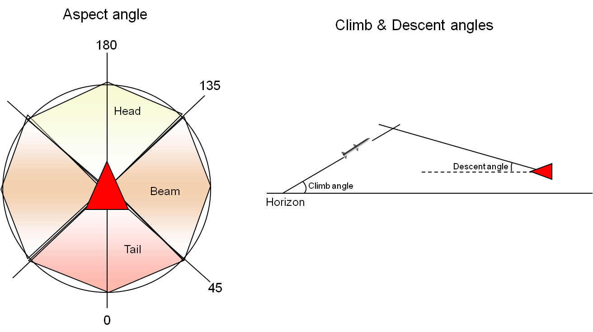

**Missile Flow**

1. **Player1::Player::runTimeCriticalRoutines(Phase 3)**

External application (*Node*) faz a chamada do método
'runTimeCriticalRoutines' da classe *WorldModel* (que estende
*Simulation*). Esse método, que representa um frame da simulação, dá
origem a quatro séries de chamadas ao método de mesmo nome dos
*Players*; cada série representa uma phase do frame: 'dynamics',
'transmit', 'receive' e 'process'. O pseudo-código dessa sequência de
chamadas é fornecido a seguir.

| WorldModel::runTimeCriticalRoutines()
| {
| **for** (i **in** 0:3)
| {
| phase = i;
| **for** (**each** Player)
| {
| Player.runTimeCriticalRoutines();
| } 
| }
| frame += 1;
| }
| Player::runTimeCriticalRoutines()
| {
| **for** (**each** **System**)
| {
| **System**.runTimeCriticalRoutines();
| } 
| }

Na fase 3, será feita a chamada runTimeCriticalRoutines(Phase 3) do
*Agent*.

2. **Agent1::Agent::runTimeCriticalRoutines(Phase 3)**

*Player* faz a chamada do método runTimeCriticalRoutines(Phase 3) do
*Agent*. Sobrepõe a implementação original, realizando as seguintes
ações:

a. Chamada ao método 'state'

b. Chamada ao método 'reasoning';

c. Chamada ao método 'action'.

3. **Agent1::Agent::action()**

Chama o método:

- 'actionReleaseMissile', se 'hasMissileReleaseAction' for TRUE.

a. **ActionReleaseMissile**

Realiza as seguintes ações:

1 - chama o método 'triggerEvent' na classe Player com o parâmetro
RELEASE_MISSILE, com a finalidade de chamar o método
'handleReleaseMissileEvent' da classe Player, que tratará do lançamento
do míssil;

2 - atualiza o peso da aeronave, descontando o peso do míssil (ver
atributos 'massLaunch' de Missile e 'grossWeight' de DynamicsModel).

4. **Component::Player1::Player::triggerEvent(RELEASE_MISSILE)**

O método 'triggerEvent' permite que um *Component* possa deflagrar um
evento em outro *Component*, especificando o tipo de evento por meio do
parâmetro 'eventType'. Neste caso, o tipo de evento é 'RELEASE_MISSILE'.
Este método aciona o método 'handleReleaseMissileEvent'.

O método retorna TRUE caso o evento tenha sido tratado, ou FALSE caso
contrário.

5. **Player1::Player::handleReleaseMissileEvent()**

O método 'handleReleaseMissileEvent' trata o evento de disparo de um
*Missile*, o que é efetivado na próxima chamada da fase 0 da simulação,
iniciando o movimento do armamento.

6. **Player2::Player::runTimeCriticalRoutines(Phase 0)**

External application (*Node*) faz a chamada do método
'runTimeCriticalRoutines' da classe *WorldModel* (que estende
*Simulation*). Esse método, que representa um frame da simulação, dá
origem a quatro séries de chamadas aos métodos de mesmo nome dos
*Players*; cada série representa uma phase do frame: 'dynamics',
'transmit', 'receive' e 'process'. O pseudo-código dessa sequência de
chamadas é fornecido a seguir.

| WorldModel::runTimeCriticalRoutines()
| {
| **for** (i **in** 0:3)
| {
| phase = i;
| **for** (**each** Player)
| {
| Player.runTimeCriticalRoutines();
| } 
| }
| frame += 1;
| }
| Player::runTimeCriticalRoutines()
| {
| **for** (**each** **System**)
| {
| **System**.runTimeCriticalRoutines();
| } 
| }

Na fase 0, será feita a chamada runTimeCriticalRoutines(Phase 0) de
*Weapon*.

7. **Weapon::runTimeCriticalRoutines(Phase 0)**

A classe *Missile* herda de *Weapon*, que, por sua vez, herda de Player.
Assim, um míssil possui um método 'runTimeCriticalRoutines' herdado da
classe *Weapon*. Na fase 0, os procedimentos realizados por esse método
são os seguintes:

-  Se 'mode' estiver definido como “pre-released” (armamento acabou de
   ser lançado), chama o método ‘atReleaseInit’ e define atributo 'mode'
   como "active";

-  Chamada ao método 'updateDynamics' da classe *Weapon*.

8. **Missile::atReleaseInit()**

O método ‘atReleaseInit’ realiza uma chamada ao método 'setLoftManeuver'
e define o seeker como inativo (atributo ‘isSeekerOn’).

9. **Missile::setLoftManeuver()**

O método 'setLoftManeuver' define se o míssil deve ou não realizar a
manobra de *loft*, em função de variáveis como a distância para o alvo,
a altitude do alvo, a razão de aproximação entre atirador e alvo, e o
valor do atributo ‘hasLoftManeuver’ (o armamento possui ou não a
capacidade de realizar a manobra de subida logo após o lançamento).

Em caso positivo, define os valores dos ângulos de subida e descida da
manobra (‘loftClimbAngle’ e ‘loftDiveAngle’). O valor do atributo
‘loftClimbAngle’ é definido como função do ângulo de aspecto entre o
atirador e o alvo no momento do disparo.

10. **Missile::updateTrack()**

Esse método atualiza as informações de track do alvo (atributo
‘tgtTrack’), escolhendo entre duas fontes: uplink com a aeronave
lançadora ou o próprio seeker do míssil.

Se o seeker estiver ativo (definido pelo atributo ‘isSeekerOn’), realiza
chamada ao método ‘updateTrackByTrackManager’.

Se o seeker estiver inativo, chama o método ‘hasUplink’ para verificar
se há, de fato, comunicação com a aeronave lançadora. Em caso positivo,
atualiza o track do alvo chamando o método ‘updateTrackByUplink’; em
caso negativo, usa as predições fornecidas pelo Track Manager feitas a
partir do último estado conhecido do alvo.

a. **Missile::updateTrackByTrackManager()**

..

   Um objeto criado como instância da classe *Missile* tem um radar em
   sua estrutura, que representa o seeker do armamento. Este radar de
   bordo tem por objetivo obter e manter um track do alvo de maneira
   autônoma. O track, por sua vez, é gerenciado pelo Track Manager
   associado ao seeker, isto é, a cada frame da simulação em que o
   seeker obtiver informações do alvo, o Track Manager receberá uma
   atualização.

   Uma chamada a este método, portanto, faz com que o valor do atributo
   ‘tgtTrack’ (ver classe *Weapon*) seja atualizado com a informação
   mais recente do alvo, provida pelo seeker.

b. **Missile::updateTrackByUplink()**

..

   Faz uma chamada ao método ‘hasUplink’ para certificar-se de que
   existe comunicação entre a aeronave lançadora e o míssil. Em caso
   positivo, atualiza as informações do Track Manager do míssil e do
   atributo ‘tgtTrack’ com os dados fornecidos pelo radar da aeronave
   lançadora.

c. **Missile::hasUplink()**

..

   Compara as posições e direções da aeronave lançadora e do míssil para
   decidir se existe comunicação efetiva entre as duas plataformas. A
   intenção do método é representar (simular) uma comunicação por
   *datalink* dedicado.

   Utiliza os atributos ‘uplinkMaxRange’, ‘uplinkLauncherMaxGimbal’ e
   ‘uplinkMissileMaxGimbal’ em seus cálculos.

11. **Weapon::updateDynamics()**

Este método sobrepõe a implementação do método *'updatedynamics'* na
classe *Player,* realizando as seguintes ações:

-  Chamada ao método *‘weaponGuidance’* do míssil;

-  Chamada ao método *‘weaponDynamics’* do míssil;

-  Chamada ao método *'updateDynamics'* da classe Player.

Os métodos de guiamento e dinâmica do míssil são responsáveis por
definir os valores de algumas variáveis de estado (velocidade do corpo,
posições e velocidade angulares); o método *‘updateDynamics’* da classe
Player, por sua vez, usa as informações do estado corrente para definir
a nova posição do armamento.

12. **Missile::weaponGuidance()**

Atualiza as informações do alvo (atributo 'tgtTrack' de *Weapon*),
realizando uma chamada ao método ‘updateTrack’.

Verifica se o seeker deve passar à condição ativa, em função da
distância para o track (ver atributo ‘seekerActivationDist’).

Calcula as acelerações requeridas pelo algoritmo de navegação
proporcional (azimute e elevação).

13. **Missile::updateTrack()**

Ver item 9.

14. **Missile::weaponDynamics()**

Atualiza as variáveis de estado do míssil (ângulos de Euler, velocidades
lineares e angulares, massa, empuxo, ângulo de ataque, etc), com exceção
da posição, cuja atualização é realizada pela classe *Player*. Para
detalhes sobre os cálculos envolvendo a atualização de estados, consulte
os códigos em R fornecidos juntamente com a documentação do míssil.

O método 'weaponDynamics' verifica também a distância de separação entre
míssil e alvo, e caso essa distância seja inferior ao atributo
'lethalRange', o método deflagra um evento de kill para o player alvo.

15. **Player2::Player::setEulerAngles()**

Define o valor do atributo ‘eulerAngles’ da classe *Player*.

16. **Player2::Player::setAngularVelocities()**

Define o valor do atributo ‘angularVel’ da classe *Player*.

17. **Player2::Player::setLinearVelocities()**

Define o valor do atributo ‘velocity’ da classe *Player*.

18. **Player2::Player::updateDynamics()**

Este método usa as informações de estado (posições angulares,
velocidades lineares e angulares) definidos pelo método ‘weaponDynamics’
para calcular a nova posição do míssil.

19. **Weapon::runTimeCriticalRoutines(Phase 3)**

Por se tratar da última phase do frame, chama o método ‘updateTOF’ para
que o tempo de voo do armamento (tof) seja atualizado.

20. **Weapon::updateTOF()**

Atualiza o valor do atributo ‘tof’.

Se o valor de 'tof' for superior ao de 'maxTOF', muda o atributo 'mode'
(ver classe *Player*) para "detonated".

21. **Weapon::checkDetonationEffect()**

Pega uma lista com todos os players da simulação (faz um loop)

Se a 'rng' (distância do armamento para o player avaliado) dele for
menor que 10x a 'burstRange', ele chama um evento de detonação no
*Player*.

22. **Component::Player3::Player::triggerEvent(DETONATION)**

O método 'triggerEvent' permite que um *Component* possa deflagrar um
evento em outro *Component*, especificando o tipo de evento por meio do
parâmetro 'eventType'. Neste caso, o tipo de evento é 'DETONATION'.

O método retorna true caso o evento tenha sido tratado, ou false caso
contrário.

23. **Player3::Player::handleDetonation()**

Se a 'rng' for menor que o 'lethalRange': dispara um evento de
'KILL_EVENT'.

Se não for: calcula o dano em função da 'rng', atualizando o valor do
atributo 'damage' do *Player*.

24. **Component::Player3::Player::triggerEvent(KILL)**

O método 'triggerEvent' permite que um *Component* possa deflagrar um
evento em outro *Component*, especificando o tipo de evento por meio do
parâmetro 'eventType'. Neste caso, o tipo de evento é 'KILL'.

O método retorna true caso o evento tenha sido tratado, ou false caso
contrário.

25. **Player3::Player::handleKillEvent()**

Recebe a notificação de kill de um outro player (ex: *Missile*) e
modifica o valor do atributo 'mode' para "killed".

No método 'runNonTimeCriticalRoutines' da classe *Simulation*, os
players definidos como "killed" são removidos da simulação.
